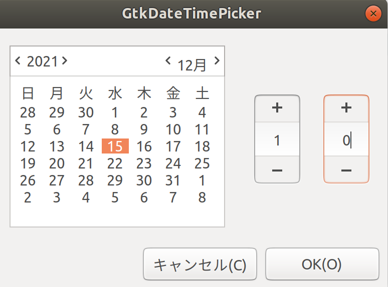

# GtkDateTimePicker

Calendar and time picker are available



```cs

 DateDialog DateDialog1 = new DateDialog();

 DateDialog1.DateTimeObj = DateTime.Now;

 var r = DateDialog1.Run();

 if (r == 1) {
     Console.WriteLine(DateDialog1.DateTimeObj);
 }
 
 DateDialog1.Dispose();

```
